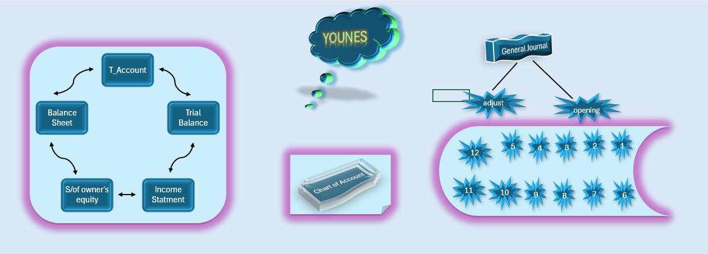

# Automated Accounting Cycle System

This project is a comprehensive Excel-based system designed to automate the full accounting cycle for a fiscal year. It ensures data integrity from initial journal entry to the final financial reports.

---

### 1. Visual Workflow & Cycle Navigation

### 2. Financial Reporting & Statements

---

## Project Description
The model is structured to function as a digital accountant. By integrating advanced formulas and dynamic references, it eliminates the need for manual posting. Once a transaction is recorded in the General Journal, the impact is reflected across all ledgers and statements instantly.

## Core Features
* **Full Accounting Integration:** Automatic synchronization between the General Journal, General Ledger, and Trial Balance.
* **Chart of Accounts (COA):** A structured coding system that organizes financial data for assets, liabilities, and equity.
* **Error Detection & Balancing:** Built-in validation checks within the Trial Balance to ensure debits and credits are in sync.
* **Dynamic Financial Statements:** Automated generation of the Income Statement, Balance Sheet, and Statement of Owner’s Equity.

## Navigation Guide
1. **Home Page:** Start here for a visual roadmap of the entire accounting process.
2. **General Journal:** Enter daily transactions using the predefined account codes.
3. **Trial Balance & Ledger:** Monitor account movements and verify accuracy.
4. **Financial Statements:** View the final automated reports and financial position.
