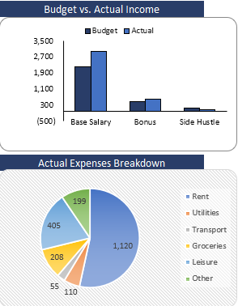

# Financial Budgeting & Forecasting Model 📈

## Overview
A comprehensive financial analysis tool developed in Excel to track budget vs. actual performance and provide long-term financial forecasts. This model is designed for dynamic business scenarios and detailed expense tracking.

---

### 📊 Financial Dashboard

### 🔍 Variance Analysis (Budget vs. Actual)

---

## 🛠️ Key Features
* **Dynamic Dashboard:** Visualized financial data using professional charts for instant insights.
* **Variance Analysis:** Automated calculation of absolute and percentage variances ($Budget$ vs $Actual$).
* **Income Statement Forecast:** Future-dated financial projections extending to 2027.
* **Scenario Planning:** "What-if" analysis using a dedicated scenario manager for operating expenses.
* **Expense Categorization:** Detailed tracking across multiple departments like Marketing, HR, and Engineering.

## 📂 Folder Contents
* `Financial_Budget_Forecasting_Model.xlsx`: The main Excel file containing all logic and data.
* `Dash.png`: High-level visual summary of the financial performance.
* `vs.png`: Detailed screenshot of the variance analysis table.

## 🚀 How to Navigate
1. Open the **Actual** tab to see current transaction entries.
2. Check the **Dashboard Finished** tab for a high-level visual summary.
3. Explore the **Forecast** and **Income Statement** tabs for future projections.