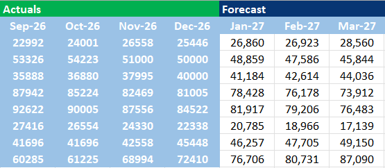
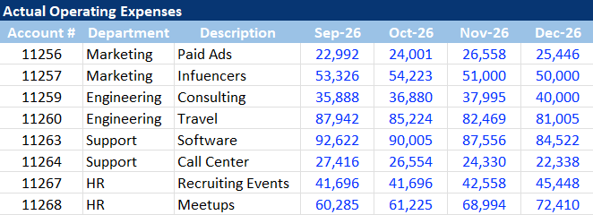
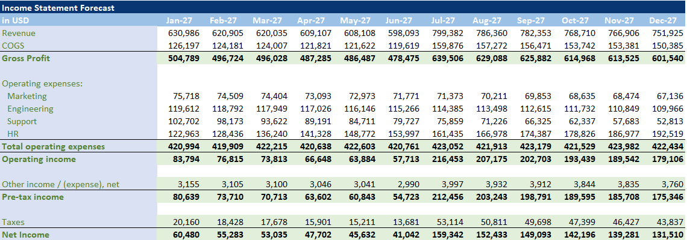

# Monthly Financial Forecasting & Income Analysis System

This professional Excel model is designed for comprehensive financial planning and tracking. It allows users to build detailed monthly forecasts, track actual expenses, and generate automated Income Statements to monitor profitability throughout the fiscal year.

---

### 1. Monthly Forecasting Framework

  

### 2. Actual Expenses Tracking

  

### 3. Automated Income Statement

  

---

## Project Description
The system bridges the gap between financial planning and actual results. By structured data entry for both forecasted projections and realized expenses, the model provides a clear view of the business's financial health through an automated Income Statement.

## Core Functionalities
* **Forecasting Engine:** Tools to build and adjust monthly financial projections.
* **Expense Management:** Dedicated tracking for actual costs to ensure budget adherence.
* **Income Analysis:** Automated calculation of net income based on integrated revenue and expense data.
* **Data Accuracy:** Formulas designed to synchronize monthly data into a final fiscal report.

## How to Navigate
1. **Build Forecast:** Start by setting your monthly projections in the forecasting tab.
2. **Record Actuals:** Update your actual expenses as they occur during the month.
3. **Review Reports:** Check the Income Statement tab for the final financial summary and net profit analysis.