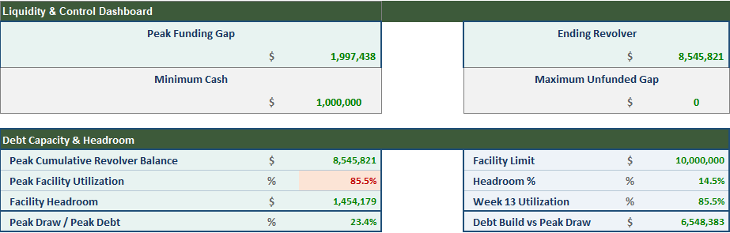
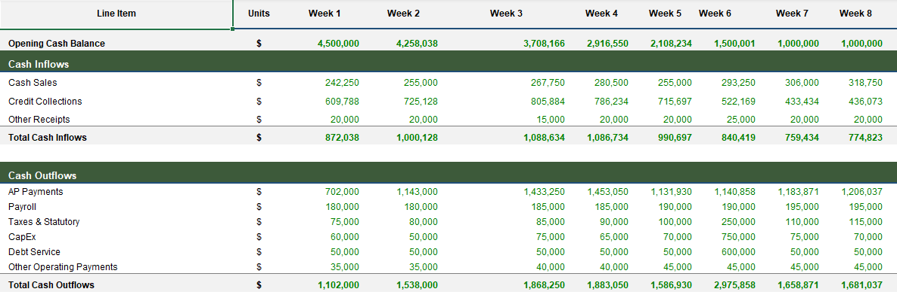
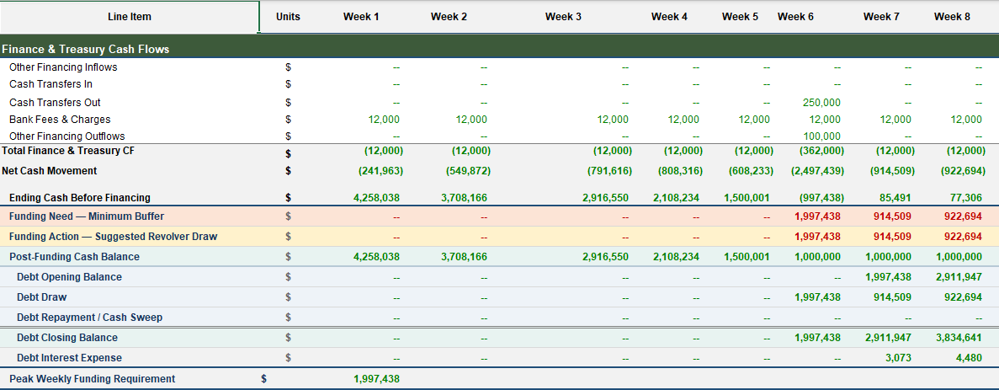
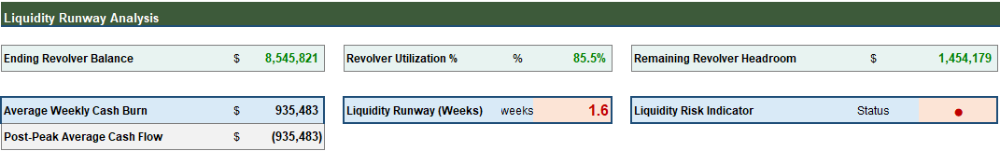

# 13-Week Cash Management & Liquidity Forecast

### Excel-Based Treasury & FP&A Model for Short-Term Liquidity Planning


A practical **Excel-based Treasury and FP&A model** designed to forecast short-term liquidity over a rolling 13-week period.

The model integrates cash-flow forecasting, working-capital timing, scenario analysis, revolver funding, liquidity controls, and management-level liquidity insights.

---

## 📑 Table of Contents

* [Overview](#-overview)
* [Why a 13-Week Cash Forecast](#-why-a-13-week-cash-forecast)
* [Business Questions Answered](#-business-questions-answered)
* [Key Features](#-key-features)
* [Workbook Structure](#-workbook-structure)
* [Model Data Flow](#-model-data-flow)
* [Key Liquidity Metrics](#-key-liquidity-metrics)
* [Core Model Logic](#-core-model-logic)
* [Scenario Framework](#-scenario-framework)
* [Liquidity Risk Framework](#-liquidity-risk-framework)
* [Example Management Insight](#-example-management-insight)
* [Recommended Management Actions](#-recommended-management-actions)
* [Controls & Validation](#-controls--validation)
* [Screenshots](#-screenshots)
* [How to Use](#-how-to-use)
* [Technical Notes & Publishing Warning](#-technical-notes--publishing-warning)
* [Repository Structure](#-repository-structure)
* [Skills Demonstrated](#-skills-demonstrated)
* [Intended Audience](#-intended-audience)
* [Disclaimer](#-disclaimer)
* [Author](#-author)
* [License](#-license)
* [Arabic Summary](#-arabic-summary)

---

## 📌 Overview

The **13-Week Cash Management & Liquidity Model** is a short-term Treasury and FP&A forecasting model focused on **cash availability, timing, funding requirements, borrowing capacity, and liquidity risk**.

Unlike an accounting-focused model that primarily evaluates profitability, this model answers the more immediate treasury question:

> **Will the business have enough cash when it needs it?**

The model is designed to function as:

* A **13-week rolling cash forecast**
* An **early-warning liquidity tool**
* A **working-capital monitoring framework**
* A **revolver funding and borrowing-capacity model**
* A **scenario analysis framework**
* A **management reporting tool** for Treasury and FP&A

---

## 🎯 Why a 13-Week Cash Forecast?

A 13-week cash forecast provides a detailed short-term view of expected cash movements.

It helps management identify liquidity pressure before it becomes a funding crisis.

A business may be profitable from an accounting perspective while still facing short-term cash pressure due to:

* Delayed customer collections
* Large supplier payments
* Payroll and statutory obligations
* Capital expenditure
* Debt-service requirements
* One-time cash outflows
* Financing constraints

The model therefore focuses on **cash timing and liquidity availability**, rather than profit alone.

---

## ❓ Business Questions Answered

| Treasury Question                                         | Model Output                                                          |
| --------------------------------------------------------- | --------------------------------------------------------------------- |
| **How much cash comes in each week?**                     | Cash sales + AR collections + other receipts                          |
| **How much cash goes out?**                               | AP payments + payroll + taxes + CapEx + debt service + other payments |
| **When does liquidity pressure occur?**                   | Cash before financing vs. minimum cash buffer                         |
| **How much funding is required?**                         | Weekly funding gap                                                    |
| **How much revolver borrowing is needed?**                | Suggested revolver draw                                               |
| **How much facility capacity remains?**                   | Revolver utilization + remaining headroom                             |
| **How severe is the liquidity pressure?**                 | Peak funding + runway + utilization                                   |
| **How long can the business continue funding cash burn?** | Liquidity Runway                                                      |
| **How sensitive is liquidity to assumptions?**            | Base / Conservative / Stress scenarios                                |

---

## ⚙️ Key Features

### 💵 Cash Forecasting

* 13-week direct cash forecast
* Weekly opening and ending cash balances
* Cash inflow and outflow analysis
* Net weekly cash movement
* Cash-before-financing analysis
* Cash-after-financing analysis

### 🔄 Working Capital

* Cash sales and credit sales
* Existing AR collections
* Current-week AR collections
* 1-week and 2-week collection lags
* Existing AP payments
* Current-week AP payments
* 1-week and 2-week payment lags

### 🏭 Operating Cash Outflows

* Payroll
* Taxes and statutory payments
* Capital expenditure
* Debt service
* Other operating payments
* Cash transfers
* Bank fees
* Other financing outflows

### 🏦 Financing & Liquidity

* Minimum cash buffer
* Funding-gap calculation
* Revolver draw logic
* Revolver repayment / cash sweep
* Revolver interest expense
* Facility utilization
* Remaining borrowing capacity
* Unfunded liquidity-gap monitoring

### 📊 Management Analysis

* Peak funding requirement
* Peak funding week
* Revolver utilization
* Remaining revolver headroom
* Average weekly cash burn
* Liquidity Runway
* Liquidity risk bands
* Scenario analysis
* Automated model controls

---

## 🗂 Workbook Structure

| Sheet                   | Purpose                                                                   |
| ----------------------- | ------------------------------------------------------------------------- |
| **Cover**               | Executive landing page, model overview, and navigation                    |
| **Training Data**       | Source assumptions, opening balances, and scenario drivers                |
| **Cash Inputs**         | Weekly operating, working-capital, and financing assumptions              |
| **Cash Forecast**       | Core 13-week forecast, funding mechanics, revolver schedule, and controls |
| **Liquidity Dashboard** | Executive liquidity KPIs, risk indicators, and management insights        |
| **Dashboard Support**   | Supporting dashboard calculations, chart data, and thresholds             |

The workbook follows a clear separation between:

**Inputs → Calculations → Controls → Management Outputs**

This improves transparency, traceability, and model maintainability.

---

## 🔄 Model Data Flow

```text
                    ┌──────────────────┐
                    │  Training Data   │
                    │ Assumptions &    │
                    │ Scenarios        │
                    └────────┬─────────┘
                             │
                             ▼
                    ┌──────────────────┐
                    │   Cash Inputs    │
                    │ Weekly Drivers   │
                    └────────┬─────────┘
                             │
                             ▼
                    ┌──────────────────┐
                    │  Cash Forecast   │
                    │                  │
                    │ Operating Cash   │
                    │ Working Capital  │
                    │ Financing        │
                    │ Revolver         │
                    │ Controls         │
                    └────────┬─────────┘
                             │
                             ▼
                    ┌──────────────────┐
                    │ Liquidity        │
                    │ Dashboard        │
                    │                  │
                    │ KPIs             │
                    │ Risk             │
                    │ Runway           │
                    │ Insights         │
                    └──────────────────┘
```

---

## 📊 Key Liquidity Metrics

| KPI                             | Definition                                                                     |
| ------------------------------- | ------------------------------------------------------------------------------ |
| **Minimum Cash Buffer**         | Required minimum operating cash level                                          |
| **Peak Funding Required**       | Maximum funding need during the 13-week forecast                               |
| **Peak Funding Week**           | Week of maximum liquidity pressure                                             |
| **Ending Revolver Balance**     | Outstanding revolver borrowing at the end of the forecast                      |
| **Revolver Utilization %**      | Percentage of the facility currently utilized                                  |
| **Remaining Revolver Headroom** | Unused borrowing capacity                                                      |
| **Average Weekly Cash Burn**    | Average rate of cash consumption                                               |
| **Liquidity Runway**            | Estimated number of additional weeks supported by remaining borrowing capacity |
| **Unfunded Gap**                | Liquidity requirement that cannot be covered by available facility capacity    |

---

## 🧮 Core Model Logic

### Cash Sales

```text
Cash Sales
=
Adjusted Sales Billings × Cash Sales %
```

### Total AR Collections

```text
Total AR Collections
=
Existing AR Collections
+
Current Week Collections
+
1-Week Lag Collections
+
2-Week Lag Collections
```

### Total AP Payments

```text
Total AP Payments
=
Existing AP Payments
+
Current Week Payments
+
1-Week Lag Payments
+
2-Week Lag Payments
```

### Ending Cash Before Financing

```text
Ending Cash Before Financing
=
Opening Cash
+
Total Cash Inflows
-
Total Cash Outflows
+
Finance & Treasury Cash Flow
```

### Funding Requirement

```text
Funding Need
=
MAX(
0,
Minimum Cash Buffer
-
Ending Cash Before Financing
)
```

### Revolver Draw

```text
Suggested Revolver Draw
=
MIN(
Funding Need,
Remaining Facility Headroom
)
```

### Revolver Headroom

```text
Remaining Revolver Headroom
=
Facility Limit
-
Ending Revolver Balance
```

### Revolver Utilization

```text
Revolver Utilization
=
Ending Revolver Balance
÷
Facility Limit
```

### Liquidity Runway

```text
Liquidity Runway
=
Remaining Revolver Headroom
÷
Average Weekly Cash Burn
```

Liquidity Runway is a forward-looking estimate of how many additional weeks the remaining unused revolver capacity could support the current cash-burn profile.

---

## 🎭 Scenario Framework

The model includes three predefined scenarios:

| Scenario         | Sales Factor | AR Collection Factor | AP Payment Factor | CapEx Factor |
| ---------------- | -----------: | -------------------: | ----------------: | -----------: |
| **Base**         |         1.00 |                 1.00 |              1.00 |         1.00 |
| **Conservative** |         0.95 |                 0.90 |              0.95 |         0.80 |
| **Stress**       |         0.85 |                 0.75 |              0.90 |         0.50 |

### Scenario Interpretation

**Base**

Represents the normalized operating case.

**Conservative**

Assumes weaker sales and collections combined with more cautious cash spending.

**Stress**

Represents a more significant deterioration in sales and collections while also assuming management can defer a portion of discretionary CapEx to preserve liquidity.

> **Important:** The Stress Case is therefore a **liquidity-management stress scenario**, not a pure downside operating scenario. Lower CapEx and delayed supplier payments can temporarily improve cash despite weaker operating performance.

---

## 🚦 Liquidity Risk Framework

### Liquidity Runway

|        Runway | Status   | Interpretation                             |
| ------------: | -------- | ------------------------------------------ |
| **> 6 weeks** | 🟢 GREEN | Comfortable liquidity cushion              |
| **3–6 weeks** | 🟡 AMBER | Active monitoring required                 |
| **< 3 weeks** | 🔴 RED   | Immediate liquidity action may be required |

### Revolver Utilization

|     Utilization | Status           | Interpretation                       |
| --------------: | ---------------- | ------------------------------------ |
|       **< 60%** | 🟢 GREEN         | Comfortable borrowing capacity       |
| **60% – < 80%** | 🟡 AMBER         | Elevated reliance on facility        |
|       **≥ 80%** | 🔴 RED / WARNING | Limited remaining borrowing capacity |

These thresholds are illustrative and should be aligned with the company's actual liquidity policy and risk appetite.

---

## 📈 Example Management Insight

Under the current **Conservative Scenario**, the model identifies significant liquidity pressure around **Week 6**.

Illustrative current-model outputs include:

| Metric                          | Current Result |
| ------------------------------- | -------------: |
| **Peak Funding Required**       |    **~$2.09M** |
| **Peak Funding Week**           |     **Week 6** |
| **Ending Revolver Balance**     |    **~$8.11M** |
| **Revolver Utilization**        |       **~81%** |
| **Remaining Revolver Headroom** |    **~$1.89M** |
| **Minimum Cash Buffer**         |     **$1.00M** |

### What is driving the pressure?

The Week 6 liquidity decline is primarily associated with the concentration of:

* Elevated CapEx
* Higher debt service
* Higher taxes
* Cash transfer out
* Other financing outflows

### Management Interpretation

The model is **funded**, but liquidity is **tight**.

This distinction is important.

A control status of `OK` means the modeled funding structure remains within the facility constraints. It does **not** necessarily mean that the company's liquidity position is comfortable.

The more important management question becomes:

> **How quickly is the remaining borrowing capacity being consumed?**

That is why the model includes **Revolver Utilization**, **Remaining Headroom**, and **Liquidity Runway** alongside the traditional cash forecast.

---

## 🧭 Recommended Management Actions

Based on the liquidity profile, management could consider:

### 1. Accelerate Customer Collections

Prioritize overdue and high-value receivables to improve near-term cash conversion.

### 2. Optimize Supplier Payment Timing

Review supplier terms and payment timing while protecting critical supplier relationships.

### 3. Control Discretionary CapEx

Defer or reschedule non-essential capital expenditures during periods of elevated liquidity pressure.

### 4. Protect Revolver Capacity

Monitor revolver utilization weekly and evaluate additional funding options before borrowing capacity becomes constrained.

### 5. Protect the Minimum Cash Buffer

Maintain the minimum operating cash requirement and avoid unnecessary discretionary cash outflows.

---

## ✅ Controls & Validation

The model includes automated controls designed to validate the integrity of the forecast.

| Control                   | Purpose                                                      |
| ------------------------- | ------------------------------------------------------------ |
| **Cash Roll-Forward**     | Confirms opening cash + net movement = ending cash           |
| **Revolver Roll-Forward** | Confirms opening debt + draws − repayments = closing debt    |
| **Facility Capacity**     | Ensures revolver exposure does not exceed the facility limit |
| **AR Roll-Forward**       | Validates receivable movement                                |
| **AP Roll-Forward**       | Validates payable movement                                   |
| **Minimum Cash Control**  | Identifies periods requiring liquidity funding               |
| **Unfunded Gap Check**    | Identifies funding needs not covered by facility capacity    |
| **Input Quality Checks**  | Validates scenario and forecast assumptions                  |

All controls should return an acceptable status such as:

```text
OK
PASS
```

Any exception should be investigated before the forecast is used for management decisions.

---

## 🖼 Screenshots

The following screenshots demonstrate the model's forecasting, dashboard, and liquidity-analysis capabilities.

### Executive Liquidity Dashboard



---

### 13-Week Cash Forecast — Part 1



---

### 13-Week Cash Forecast — Part 2



---

### Liquidity Runway Analysis



---

> **Note:** Keep the image filenames exactly as shown above and place them inside the repository's `images/` folder. GitHub will render them automatically when the repository structure matches the paths in this README.

---

## 🚀 How to Use

### Step 1 — Open the Workbook

Open:

```text
Cash_Management_13_Week_Liquidity_Model.xlsx
```

### Step 2 — Review the Inputs

Review:

* Opening cash
* Opening AR
* Opening AP
* Minimum cash buffer
* Revolver facility
* Revolver APR
* Weekly sales
* Collection assumptions
* Supplier-payment assumptions
* Operating cash outflows

### Step 3 — Select a Scenario

Choose:

```text
Base
Conservative
Stress
```

### Step 4 — Validate the Model

Review all input-quality and model-control checks.

### Step 5 — Review the Cash Forecast

Analyze:

* Cash inflows
* Cash outflows
* Net cash movement
* Ending cash before financing
* Funding gaps
* Revolver draws
* Revolver repayments
* Ending revolver balance

### Step 6 — Review Liquidity KPIs

Focus on:

* Peak Funding Required
* Peak Funding Week
* Ending Revolver
* Revolver Utilization
* Remaining Headroom
* Average Weekly Cash Burn
* Liquidity Runway
* Risk Status

---

## ⚠️ Technical Notes & Publishing Warning

The working version of the workbook may contain a hidden technical worksheet named:

```text
__tracelight_scratchpad__
```

This worksheet is technical in nature and is **not intended for public distribution**.

### Before publishing to GitHub

1. Permanently delete the technical worksheet.
2. Save the clean public version of the workbook.
3. Recalculate the workbook.
4. Verify all formulas and controls.
5. Confirm the Dashboard and Liquidity Runway still function correctly.
6. Confirm that no confidential, personal, or proprietary information is included.

The public GitHub repository should contain only the **clean portfolio version** of the model.

---

## 📁 Repository Structure

```text
13-week-cash-management-liquidity-model/
│
├── README.md
├── LICENSE
├── .gitignore
├── Cash_Management_13_Week_Liquidity_Model.xlsx
│
├── images/
│   ├── dashboard-1.png
│   ├── cash-forecast-2.png
│   ├── cash-forecast-3.png
│   └── liquidity-runway-4.png
│
└── documentation/
    └── MODEL_DOCUMENTATION.md
```

The repository separates:

```text
Model
   ↓
Documentation
   ↓
Visual Evidence
   ↓
Management Insights
```

This structure makes the project easier to review for recruiters, hiring managers, finance professionals, and other users.

---

## 🧠 Skills Demonstrated

### Financial Modeling

* Driver-based forecasting
* Integrated Excel modeling
* Scenario analysis
* Financial controls
* Formula-based model architecture

### Treasury

* 13-week cash forecasting
* Liquidity management
* Funding requirements
* Revolver management
* Borrowing-capacity analysis
* Liquidity runway analysis

### FP&A

* Cash planning
* Forecast analysis
* Scenario modeling
* Management reporting
* Financial decision support

### Working Capital

* AR collection timing
* AP payment timing
* Cash conversion analysis
* Short-term liquidity planning

### Management Analysis

* Liquidity risk assessment
* Cash-burn analysis
* Funding analysis
* Scenario interpretation
* Management recommendations

---

## 👥 Intended Audience

This portfolio project is relevant for:

* Financial Analysts
* FP&A Analysts
* Treasury Analysts
* Cash Managers
* Corporate Finance Professionals
* Working Capital Analysts
* Finance Students
* Financial Modeling Professionals

---

## ⚠️ Disclaimer

This project is an **educational and portfolio financial-modeling exercise**.

All assumptions, scenarios, transactions, and financial figures are synthetic and illustrative.

The model should not be interpreted as:

* Investment advice
* Lending advice
* Financial advice
* A forecast for an actual company
* A representation of any company's financial position

---

## 👤 Author

**Mohamed Yones**

### Financial Modeling | FP&A | Treasury & Liquidity Analysis

**Core Skills**

`Excel` · `Financial Modeling` · `Treasury` · `Cash Forecasting` · `Working Capital` · `Scenario Analysis` · `Liquidity Management` · `FP&A`

---

## 📄 License

This project is licensed under the **MIT License**.

See the [`LICENSE`](LICENSE) file for details.

---

## 🇪🇬 Arabic Summary

### نموذج إدارة النقد والسيولة لمدة 13 أسبوعًا

هذا المشروع عبارة عن نموذج مالي مبني باستخدام **Microsoft Excel** لتحليل وإدارة السيولة قصيرة الأجل.

النموذج يركز على:

* التنبؤ بالنقد الداخل والخارج أسبوعيًا
* تحديد فترات الضغط على السيولة
* تحديد الاحتياج التمويلي
* إدارة الـRevolver
* متابعة القدرة التمويلية المتبقية
* تحليل معدل حرق النقد
* حساب Liquidity Runway
* مقارنة السيناريوهات المختلفة
* تقديم مؤشرات وتحليلات تساعد الإدارة في اتخاذ القرار

ويجمع النموذج بين:

**Cash Forecasting + Treasury + FP&A + Working Capital + Revolver Management + Scenario Analysis + Liquidity Runway**

والهدف الأساسي هو تحويل البيانات والافتراضات المالية إلى **رؤية واضحة للسيولة والتمويل والقرارات الإدارية**، وليس مجرد إنتاج جدول Excel.

---

## ⭐ Portfolio Takeaway

> **A decision-ready 13-week Treasury model that connects operating cash flows, working capital, financing capacity, scenario analysis, and liquidity risk into one integrated Excel framework.**
