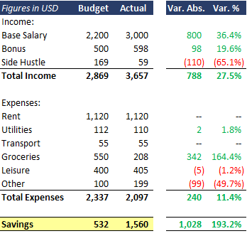
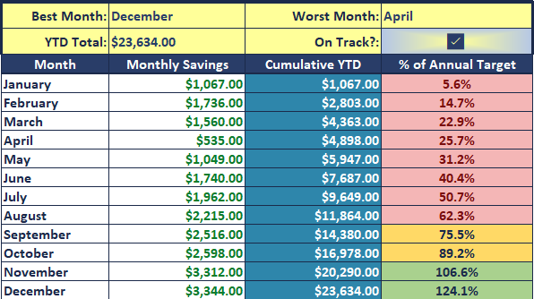
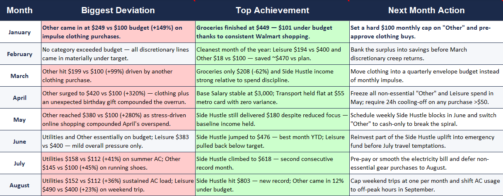

# Financial Budgeting & Forecasting Model

This project features a professional financial model developed in Excel, designed to provide a clear comparison between budgeted targets and actual performance, alongside dynamic forecasting capabilities.

---

### 📊 Financial Dashboard

### 📈 Budget vs. Actual Variance Analysis

### 📋 Monthly Review & Data Tracking

### 🔍 Year-to-Date (YTD) Performance Analysis

---

## Project Description
The model serves as a strategic tool for financial monitoring. It includes a comprehensive income statement, expense tracking across multiple corporate categories, and automated variance analysis ($Abs$ and $\%$). It is built to handle dynamic data entries and translate them into visual insights for better executive decision-making.

## Key Components
* **Budget vs. Actual Analysis:** Real-time tracking of income and expenses to instantly identify financial gaps and overruns.
* **Monthly Data Entry Architecture:** Organized structure for recording transactions cleanly by category and description.
* **Automated Visuals:** Dynamic charts and summary tables that update automatically based on any data input.
* **Fiscal Projections:** Financial forecasting tools to help plan, allocate resources, and forecast upcoming fiscal periods.

## How to Navigate the File
1. Use the **Actual** tab for daily or monthly transaction entries.
2. Refer to the **Budget** tab to set and lock your financial targets.
3. Use the **Dashboard Finished** tab for the final visual analysis, trends, and summary reports.

---
*Maintained with a focus on financial precision, automated control, and data integrity.*