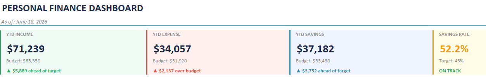
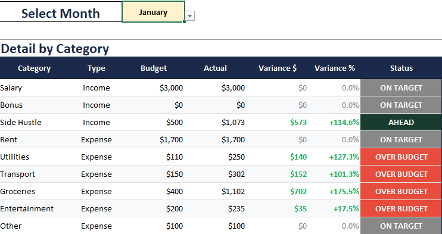
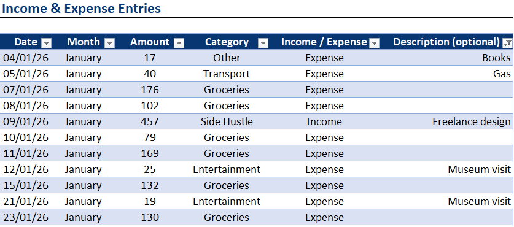
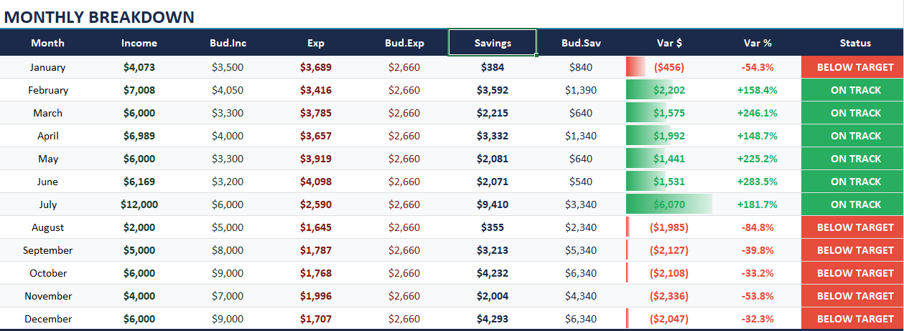
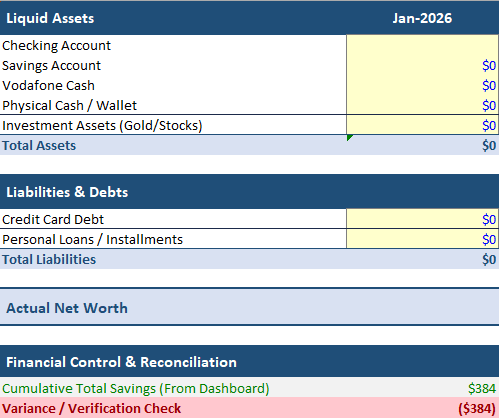

# Personal Wealth & Budget Optimization Model

A comprehensive, dynamic personal finance intelligence framework built in Microsoft Excel. This model transitions personal budgeting from simple expense tracking to a professional control framework—incorporating variance analysis, dynamic savings rate optimization, and a detailed month-over-month Net Worth tracker.

---

### 📊 Personal Finance Dashboard

### 📈 Budget vs. Actual Variance Control

### 📓 Transaction & Income Ledger

### 🎯 Dynamic Fiscal Budget Targets

### 💼 Month-over-Month Net Worth Tracker

---

## Project Description
This financial model acts as a personal FP&A (Financial Planning & Analysis) tool, allowing users to define strict monthly budget targets, log daily transactions across multiple life categories, and instantly view financial health through dynamic KPIs. It goes beyond standard budgeting by offering an automated Net Worth sheet that monitors liquid assets and personal liabilities over a rolling 12-month period.

## Key Components
* **Personal Finance Dashboard:** Real-time visibility into Year-to-Date (YTD) Income, Total Expenses, and Cumulative Savings, alongside automated indicators tracking Savings Rate metrics against a 45% target.
* **Budget vs. Actual Control Framework:** Automated conditional formatting highlighting budget compliance status (`ON TARGET`, `AHEAD`, or `OVER BUDGET`) with variance analysis for individual spending lines.
* **Transaction Ledger System:** Clean data architecture designed to log incoming cash and discretionary expenses by date, type, and specific description.
* **Rolling Net Worth Architecture:** Strategic asset and debt mapping table tracking Checking/Savings accounts, digital wallets, cash reserves, and gold/stock investments versus outstanding credit card or installment liabilities.

## How to Navigate the File
1. **Entries:** Use this tab to log your daily transaction details, amounts, and specific categories cleanly.
2. **Budget Targets:** Set your baseline expectations for monthly income, fixed costs, and discretionary spending envelopes across the year.
3. **Budget vs Actual:** Select the desired month from the drop-down menu to run a targeted financial variance review.
4. **Dashboard:** Review the dynamic chart layouts and aggregated YTD figures to gauge financial performance and savings velocity.
5. **Net Worth:** Update your asset values and liabilities at month-end to visualize long-term wealth accumulation trends.

---
*Engineered to bridge corporate budgeting disciplines with personal asset accumulation and data visualization.*